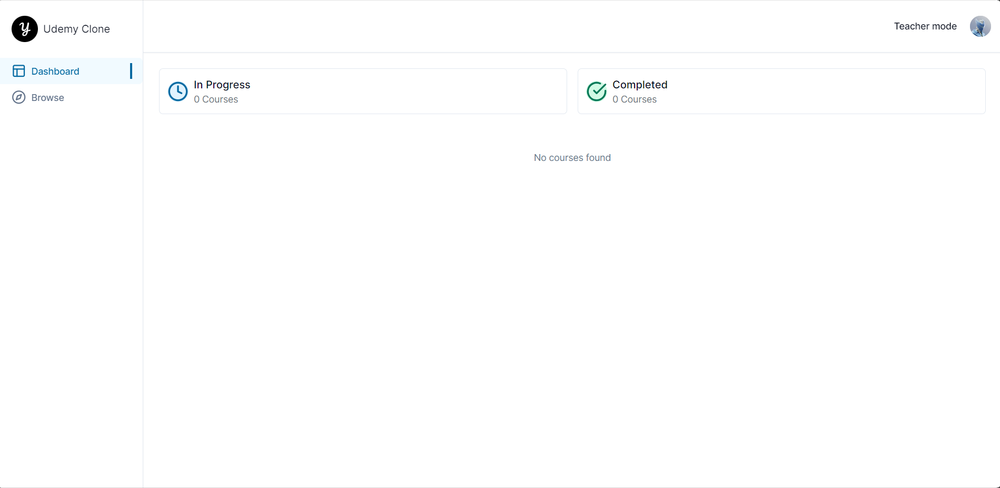

# UDEMY CLONE



> Simple LMS Web Application using Next, React, Stripe, Mux, Prisma, MySQL and more...

**Website: <https://udemy-clone-yanji.vercel.app/>**

## 🤔 Why ?

upadting...

## 🛠️ Config

##### .env file template
  
```bash
  NEXT_PUBLIC_CLERK_PUBLISHABLE_KEY=pk_test_abcdefegh # replace with your key
  CLERK_SECRET_KEY=sk_test_abcdefeghjj # replace with your key
  NEXT_PUBLIC_CLERK_SIGN_IN_URL=/sign-in
  NEXT_PUBLIC_CLERK_SIGN_UP_URL=/sign-up
  NEXT_PUBLIC_CLERK_AFTER_SIGN_IN_URL=/
  NEXT_PUBLIC_CLERK_AFTER_SIGN_UP_URL=/

  # This was inserted by `prisma init`:
  # Environment variables declared in this file are automatically made available to Prisma.
  # See the documentation for more detail: https://pris.ly/d/prisma-schema#accessing-environment-variables-from-the-schema

  # Prisma supports the native connection string format for PostgreSQL, MySQL, SQLite, SQL Server, MongoDB and CockroachDB.
  # See the documentation for all the connection string options: https://pris.ly/d/connection-strings

  DATABASE_URL="mysql://admin:<your_mysql_password>@localhost:<your_port>/<your_db_name>?schema=public" # this will auto create for you when init prisma or you can custom like me :D 

  # upload thing
  # visit: https://docs.uploadthing.com/getting-started/appdir

  UPLOADTHING_SECRET=sk_live_abbbddssee # replace with your key
  UPLOADTHING_APP_ID=abcd123 # replace with your key

  MUX_TOKEN_ID=
  MUX_TOKEN_SECRET=

  STRIPE_API_KEY=sk_test_abcedefa # replace with your key
  STRIPE_WEBHOOK_SECRET= whsec_abedaweb # replace with your key

  NEXT_PUBLIC_APP_URL=http://localhost:3000

  NEXT_PUBLIC_TEACHER_ID=user_abc123  # replace with your user id
```

## 🐣 How to run

upadting...

## ⚖️ License

MIT. Made with 💖